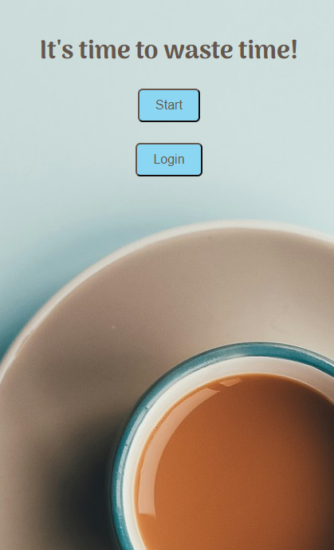
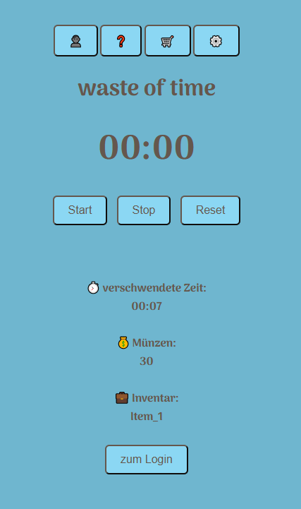
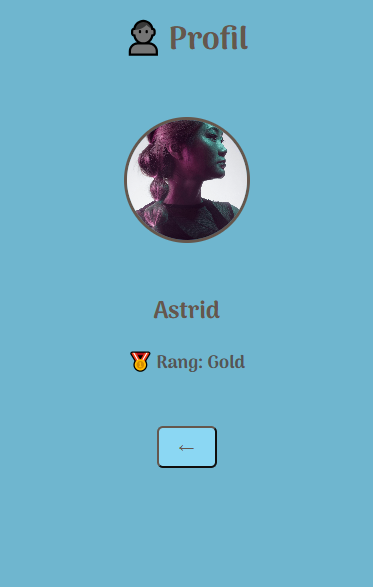
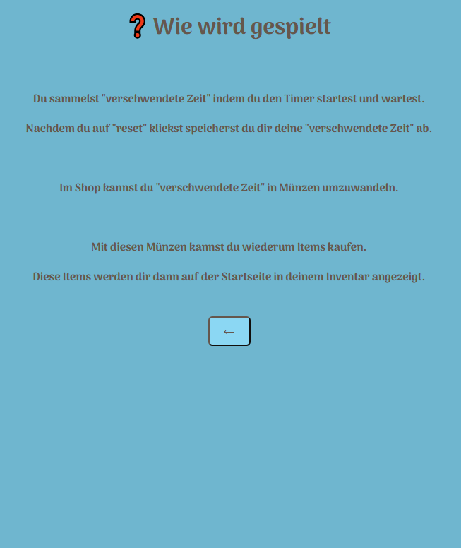
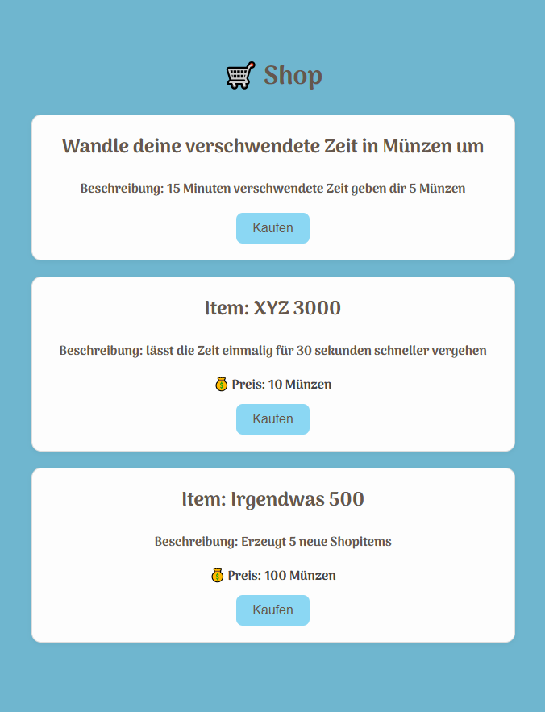
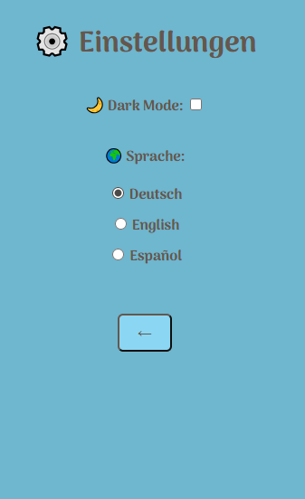

# WasteOfTime

A little game with a timer where you are rewarded for doing nothing

## 🕑 Current status

<table>
  <tr>
    <td></td>
    <td></td>
    <td></td>
  </tr>
  <tr>
    <td></td>
    <td></td>
    <td></td>
  </tr>
</table>

## ✔️ ToDo´s

- ~~Grundgerüst erstellen~~
- ~~Startseite erstellen~~
- ~~Hauptseite erstellen~~
- ~~Timer mit den Funktionen Start, Pause uns Reset~~
- ~~Navigationsleiste oben oder unten erstellen mit "Profil", "Einstellungen" und "Shop"~~
- ~~Nach Ablauf bestimmter Zeit Sätze einblenden~~
- ~~"verschwendete Zeit" zusammenrechnen lassen und als "Spielwährung" anzeigen~~
- ~~Shop erstellen, indem man die "verschwendete Zeit" einlösen kann~~
- ~~Shopitem 'umwandler' einfügen (verschwendete Zeit im Münzen umwandeln)~~
- ~~Einstellungsseite erstellen~~
- ~~Profilseite erstellen~~
- ~~Name im Profil bearbeiten~~
- ~~Profilbild im Profil bearbeiten~~
- ~~weitere Sprachen (Englisch & Spanisch) einfügen~~
- Alle Sprachen einpflegen über das json
- Weitere Shopitems einfügen
- Icon für App einfügen
- Namen im code (z.B für klassennamen usw) alle einheitlich
- Screen für Login (Formular)
- Darkmode fixen
- Design ändern / verschönern
- Funktion des Items Sanduhr
- Funktion des Items Praktikant
- Quick time events (Minispiel) einfügen um Münzen zu erlangen
- Statistiken in den Einstellungen anzeigen (z.B insgesamt verschwendete Zeit)
- Info´s zum Rang im Profil einfügen
- Alert wenn neuer Rang erreicht wurde

## 🟦 Color Reference

| Hex     |
| ------- |
| #65574D |
| #6FB6CF |

## 📃 License

[MIT](https://choosealicense.com/licenses/mit/)
